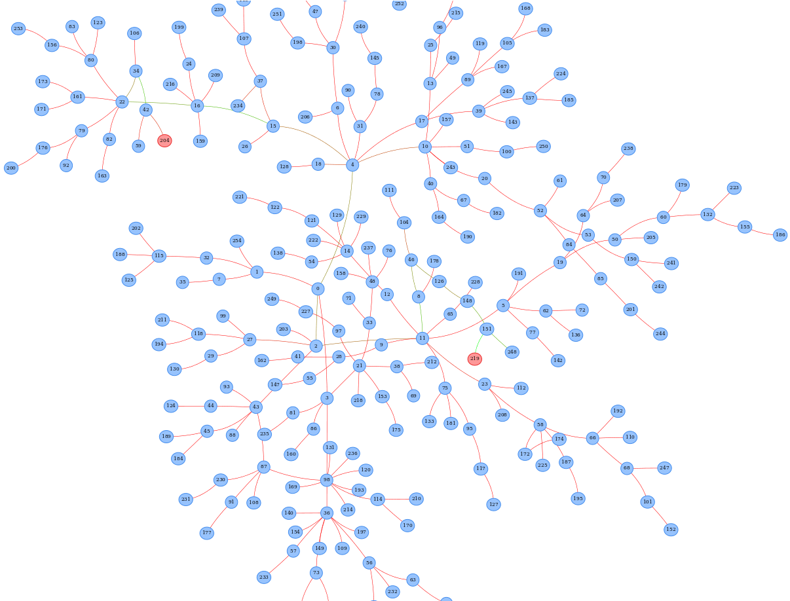

# Ant Colony Optimisation

 - George Brighton ([@gebn](https://github.com/gebn))
 - Lily ([@Lily418](https://github.com/Lily418))

## Introduction

Ant Colony Optimisation is a probabilistic technique, based on the behaviour of ants searching for food. We investigated how it can be implemented on a GPU to find efficient paths to a goal.

First, we implemented a sequential CPU version of the program, which can be found in `cpu.cpp`. We then took the same logic, and parallelised it for execution on the GPU. This implementation can be found in `gpu.cu`.

## Building

From within the project directory, run:

    ./build.sh

to compile the code.

## Running

After building the project as detailed above, it can be run by typing:

    firefox visualisation.html

This will produce a graph resembling the following:

Edges between nodes are coloured depending on pheromone levels, with green the maximum (indicating lots of ants are taking the path), and red the minimum (the transition is unpopular). Most will be somewhere in the middle, giving them a brown colour.

In the graph above, the two red nodes are the initial and goal nodes of the search. The route can be seen as a green path between them. Note that it is not optimal; even though ACO is capable of producing an optimal route in finite time, it is not easy to predict how long it will take. A 'good enough' solution is its most frequent use case.

*We have not submitted a video demonstration because our visualisation is essentially static, and can be much more easily understood with the above image.*

### Timings

In our tests with 512 ants, the sequential implementation took an average of 180ms, while the GPU implementation took 80ms. This is a 125% increase. Similarly, tests with 2048 ants showed a larger increase of 72%, with the CPU and GPU implementations taking  740 and 202ms respectively.
